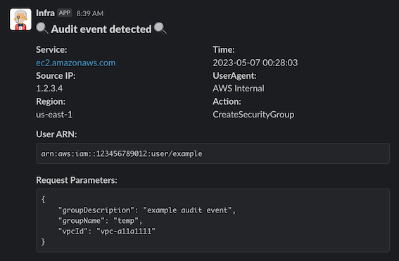

# AWS Watch

A lambda function that monitors AWS Cloudtrail management events and publishes them to a slack channel

<p align="center">
  
</p>

## Getting Started
- setup a slack bot to receive the events
- setup cloudtrail management events
- build the lambda function
- deploy to ECR

## Testing locally
```
cd deploy/sam
cat >> dev.json << 'END'
{
  "Parameters": {
    "SLACK_CHANNEL_ID": "<MY_SLACK_CHANNEL_ID>",
    "SLACK_TOKEN": "<MY_SLACK_TOKEN>"
  }
}
END
sam build 
sam local invoke -e test_events/ec2_sg.json -n dev.json
```

## Deploy to AWS
```
cd deploy/sam
sam build
sam deploy
```

### Terraform
```
cd deploy/terraform
terraform init
terraform plan -var-file variables/dev.tfvars 
```
